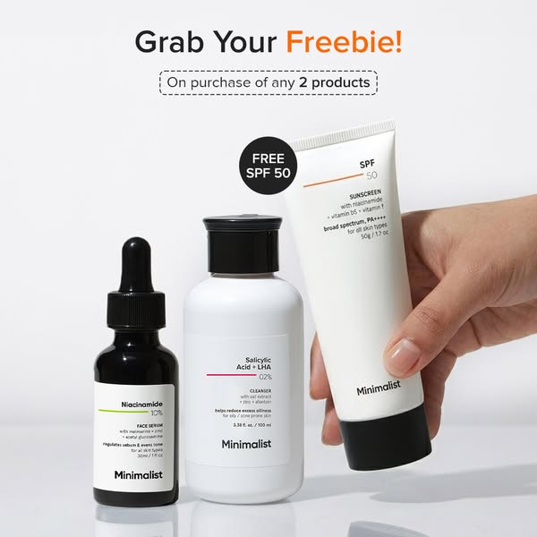
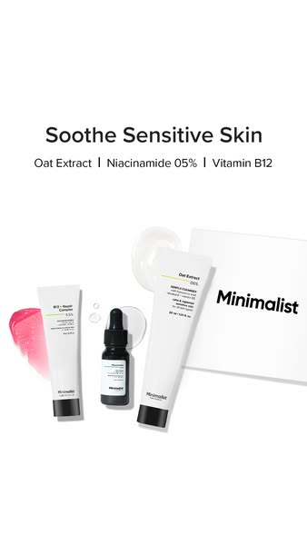
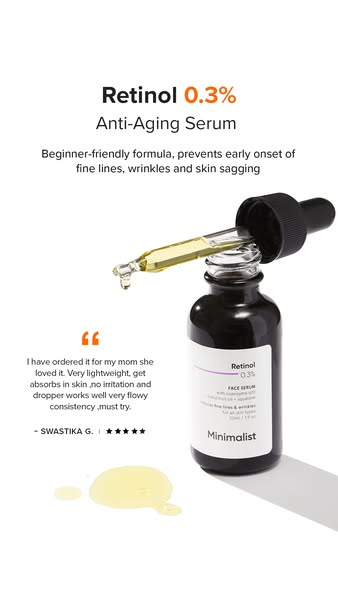
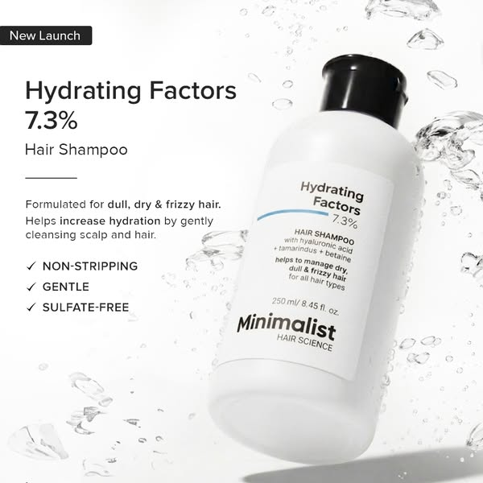
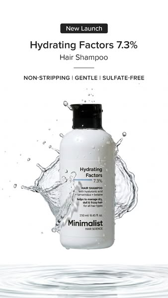

# Current static ads manifest

Observed: 2026-09-11

Source for this batch: Motion's public Minimalistinc page, which states that it
indexes active Meta ads. These files are direct inspections of Motion-cached
creative images, but they have not yet been matched to official Meta Ad Library
records. Provenance confidence is therefore `secondary-cached`.

Source page: https://motionapp.com/library/minimalistinc

## Included unique creatives

### S001 — Free SPF offer

- Product type: multi-product skincare / sunscreen offer
- Visible headline: `Grab Your Freebie!`
- Supporting copy: `On purchase of any 2 products`
- Badge: `FREE SPF 50`
- Strategy: offer-led product grouping
- Source image: https://motionswipefile.blob.core.windows.net/swipe-file-cached-links/swipe-file-source-link/1010742631285742/6a0d065124084c7acefbbea1/d81f7678-a3f7-4b95-9945-986ab7174d9c.jpg
- Evidence status: secondary-cached

### S002 — Sensitive-skin grouping

- Product type: sensitive-skin cleanser, serum, and moisturiser
- Visible headline: `Soothe Sensitive Skin`
- Supporting copy: `Oat Extract | Niacinamide 05% | Vitamin B12`
- Strategy: concern-led product grouping
- Source image: https://motionswipefile.blob.core.windows.net/swipe-file-cached-links/swipe-file-source-link/1465176794782710/6a117e16d2cb00dd45c2401b/f20b12bf-2d8d-463a-816a-1d848b587b57.jpg
- Evidence status: secondary-cached

### S003 — Retinol testimonial

- Product type: anti-ageing serum
- Visible headline: `Retinol 0.3%`
- Subhead: `Anti-Aging Serum`
- Supporting claim: `Beginner-friendly formula, prevents early onset of fine
  lines, wrinkles and skin sagging`
- Additional content: named five-star customer testimonial
- Strategy: product benefit plus social proof
- Source image: https://motionswipefile.blob.core.windows.net/swipe-file-cached-links/swipe-file-source-link/1651438576116956/6a0d065124084c7acefbbe97/8038245d-62be-4df9-8353-2b8a428cb546.jpg
- Evidence status: secondary-cached

### S004 — Hydrating shampoo detail

- Product type: haircare / shampoo
- Visible headline: `Hydrating Factors 7.3%`
- Supporting claim: `Formulated for dull, dry & frizzy hair. Helps increase
  hydration by gently cleansing scalp and hair.`
- Attributes: `NON-STRIPPING`, `GENTLE`, `SULFATE-FREE`
- Strategy: feature-benefit explanation
- Source image: https://motionswipefile.blob.core.windows.net/swipe-file-cached-links/swipe-file-source-link/884424537982340/69ede223bdb47646c49845bd/ae134210-348d-4f2e-bb54-204a4f9d3f02.jpg
- Evidence status: secondary-cached

### S005 — Hydrating shampoo splash

- Product type: haircare / shampoo
- Visible headline: `Hydrating Factors 7.3%`
- Attributes: `NON-STRIPPING | GENTLE | SULFATE-FREE`
- Strategy: short feature-led product hero
- Why separate from S004: materially different copy density, layout, and
  communication argument; retained for later human review
- Source image: https://motionswipefile.blob.core.windows.net/swipe-file-cached-links/swipe-file-source-link/1890665944764854/69ede223bdb47646c49845c0/dd710f99-f217-4285-8665-469df3416198.jpg
- Evidence status: secondary-cached

### S006 — Oil-control routine

- Product type: acne/oil-control routine
- Visible headline: `High Performance Oil Control Kit`
- Functional labels: `Cleanses`, `Treats`, `Moisturizes`
- Strategy: routine simplification
- Source image: https://motionswipefile.blob.core.windows.net/swipe-file-cached-links/swipe-file-source-link/1058373816567907/6a0efffb24084c7ace06e313/d42f0b1b-76ff-4547-9379-0cc1b85000f0.jpg
- Evidence status: secondary-cached

### S007 — Inside the skin

- Product type: sensitive or inflamed skin; exact product not visible
- Visible headline: `Inside the Skin:`
- Mechanism: `UV rays, oxidative stress, pollution` → `Skin cells release
  proinflammatory cytokines` → `Causes inflammation and redness`
- Strategy: educational mechanism
- Source image: https://motionswipefile.blob.core.windows.net/swipe-file-cached-links/swipe-file-source-link/2056540261966444/6a0d065124084c7acefbbe87/fb319fdb-6d60-415d-b78e-56432bbe4114.jpg
- Evidence status: provisional secondary-cached; brand and product are not
  visible in this frame, so it needs an official record or surrounding context

## Current count

- Included images: 7
- Confirmed at secondary-cached confidence: 6
- Provisional pending surrounding context: 1
- Excluded mechanical variants retained separately: 2
