# Meta current-ad reference review

Raw accessible Library records: **80** (Meta displayed `~88 results`)

Automated candidate groups: **51**

These are candidates, not final semantic deduplication. Records are grouped only when they share exact normalized copy or an exact image file hash. Review crops, resizes, and materially different messages manually before calling them unique creative concepts.

## META-C001

- Library IDs: `1365545252142669`, `2298049150732040`, `1353654403544889`, `1630297249103116`, `881886774987581`, `1942914633083773`, `1413167237316292`, `1058556190224321`
- Raw records: 8
- Distinct exact image files: 4
- Automated grouping reason: exact-normalized-copy, exact-image-hash
- Human decision: **review-group**

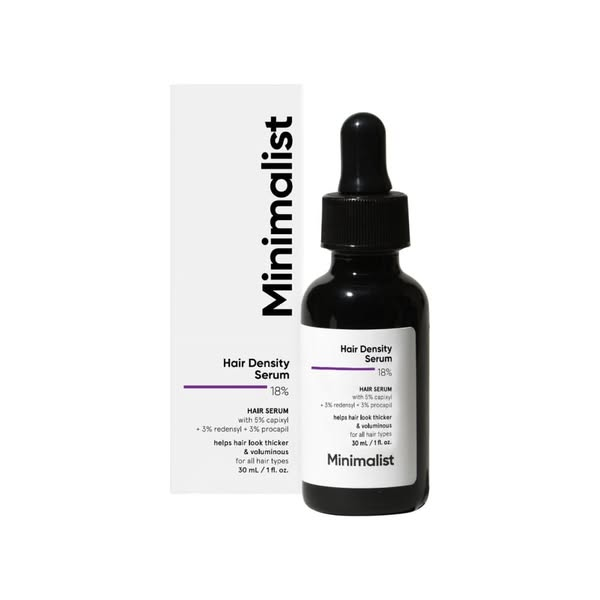

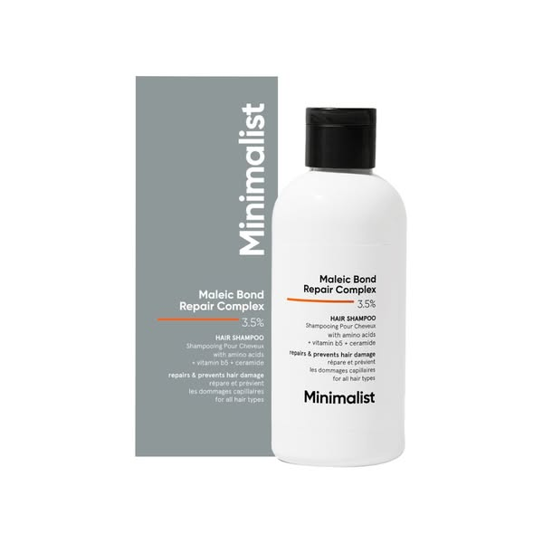

Associated ad copy

LINK.BLINKIT.COM
Minimalistinc
Shop online for groceries and get your order delivered to your doorstep. Enjoy delivery of 30,000+ products with Blinkit
Shop Now

## META-C002

- Library IDs: `1558655245151582`, `4469729779968323`, `3260977900755724`, `1021330090334834`
- Raw records: 4
- Distinct exact image files: 2
- Automated grouping reason: exact-normalized-copy, exact-image-hash
- Human decision: **review-group**

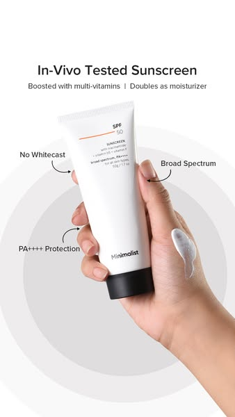

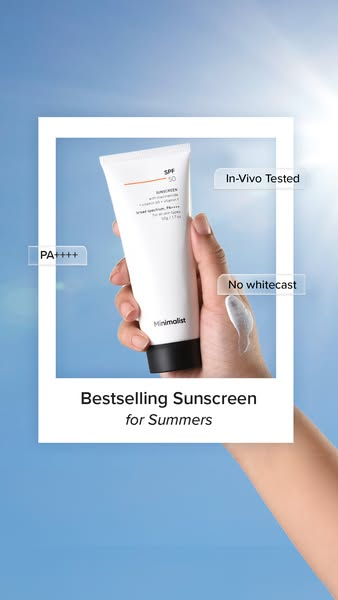

Associated ad copy

Meet your summer skincare essential.
Minimalist SPF 50 does double duty as a powerful, broad-spectrum sunscreen and a lightweight moisturizer.
- In-vivo tested for guaranteed UV safety
- Absolutely zero white cast
- Packed with Niacinamide & Vitamins B5 + F
Ditch the greasy layers and simplify your routine today.
Bestselling Sunscreen For Summer
Lightweight, multi-vitamin formula.
Shop Now

## META-C003

- Library IDs: `1694736281737007`, `2040345663535446`, `2089282301970607`, `2081652076120042`
- Raw records: 4
- Distinct exact image files: 1
- Automated grouping reason: exact-normalized-copy, exact-image-hash
- Human decision: **review-group**

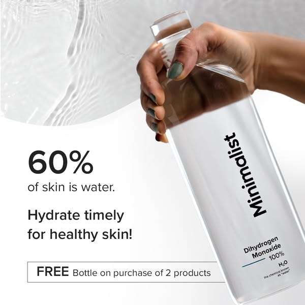

Associated ad copy

Your skin doesn’t just need actives — it needs H₂O too.
Buy any 2 Minimalist products and get our hydration-friendly bottle absolutely FREE.
Because real skin health starts from within
Actives for Skin. H₂O for Within
Support your actives with hydration. Buy any 2 products and get a water bottle worth ₹599, free.
Shop Now

## META-C004

- Library IDs: `1431234639060196`, `2528592894325996`, `1069428508846261`
- Raw records: 3
- Distinct exact image files: 3
- Automated grouping reason: exact-normalized-copy
- Human decision: **review-group**

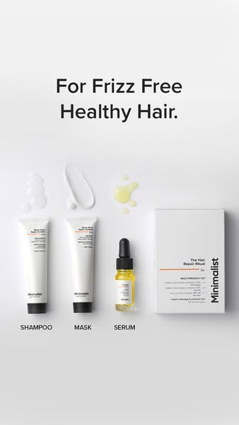

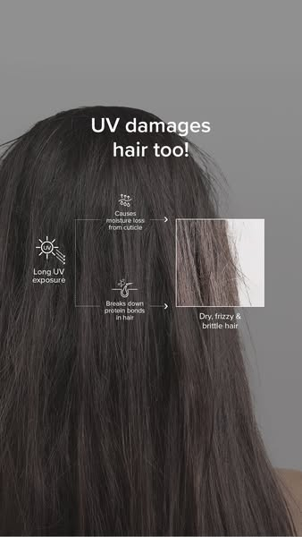

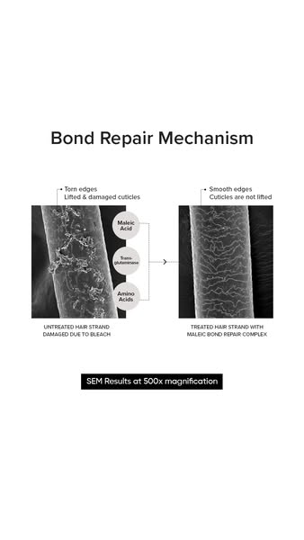

Associated ad copy

Frizz-Free, Stronger Hair in 3 Steps.
Repair damage, smooth cuticles & protect from UV — all in one powerful routine.
Step 1: Cleanse with Bond-Repair Shampoo
Step 2: Deep Repair with Bond-Repair Mask
Step 3: Shield & Smooth with Frizz Control Serum (SPF 30)
Healthier, shinier hair starts with science.
Minimalist Hair Repair Ritual Kit — because real repair is a routine.
Earn Cashback! Limited Time offer on kits!
Frizz-Free Results in 3 Uses or Less
Shop Now

## META-C005

- Library IDs: `1468840825270183`, `1023646183828867`, `1631739695274016`
- Raw records: 3
- Distinct exact image files: 3
- Automated grouping reason: exact-normalized-copy
- Human decision: **review-group**

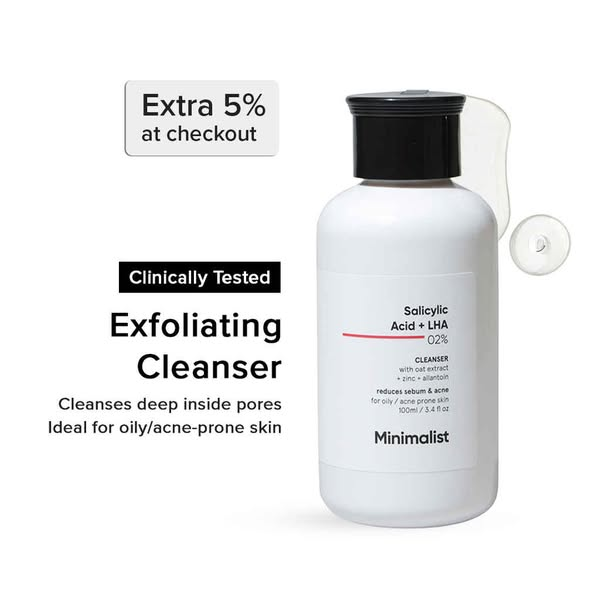

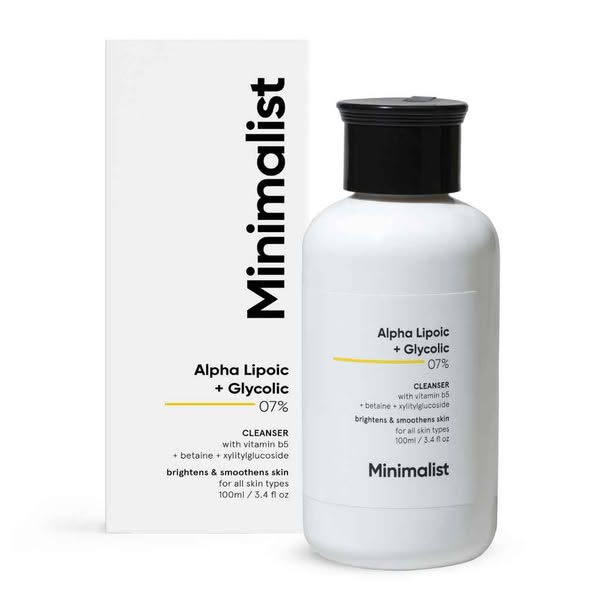

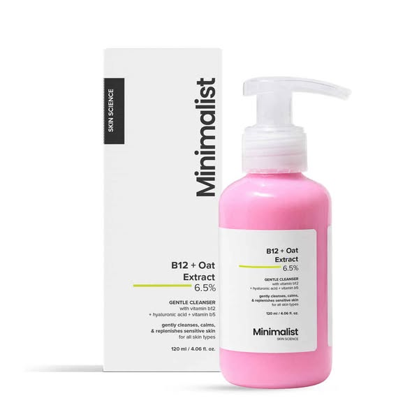

Associated ad copy

Say goodbye to oiliness, acne breakouts, and uneven skin tone! 🛡️ Proper cleansing is the very first step to clear skin. Get the Minimalist Salicylic Acid + LHA 02% Acne Control Gel Cleanser delivered to your doorstep in minutes. Formulated with Zinc and Oat Extract to reduce excess oil without drying out your skin. Shop the sale now on Zepto! ⚡🛒
ZEPTO.COM
Minimalistinc
Zepto is your next-door quick commerce app, delivering online groceries, fruits, vegetables, personal care, electronics & much more to you in just minutes.
Order Now

## META-C006

- Library IDs: `2256945501508319`, `1364232715643648`, `1427081035896461`
- Raw records: 3
- Distinct exact image files: 5
- Automated grouping reason: exact-image-hash
- Human decision: **review-group**

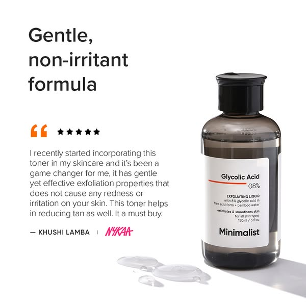

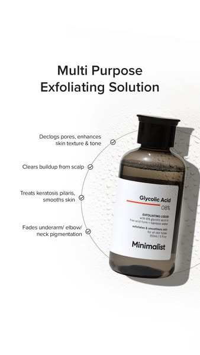

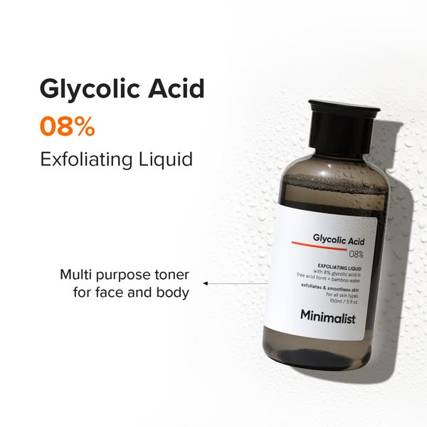

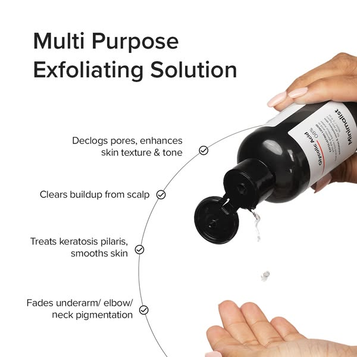

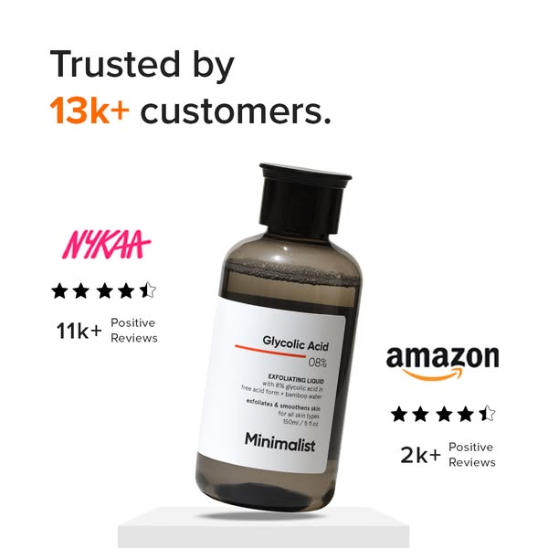

Associated ad copy

Say goodbye to clogged pores, rough patches, and uneven skin tone. The Minimalist 8% Glycolic Acid Exfoliating Liquid is your all-in-one solution for glowing skin. Gently exfoliates to improve texture, fade dark spots on elbows, underarms, and knees, and even helps with scalp buildup. Dermatologically tested, safe for daily use.
Earn Cashback on every purchase
Multi-purpose exfoliating toner for face, body, and scalp care.
Shop Now

## META-C007

- Library IDs: `2572695826504803`, `1539208064339221`, `1020829984164191`
- Raw records: 3
- Distinct exact image files: 2
- Automated grouping reason: exact-image-hash
- Human decision: **review-group**

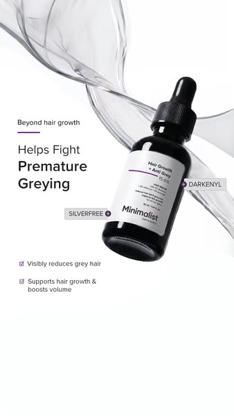

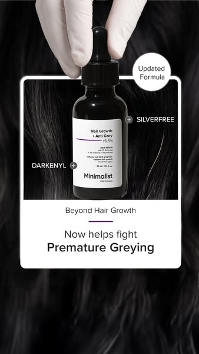

Associated ad copy

New Launch!!
Why choose between hair growth and anti-greying when you can do both?
Meet the NEW Minimalist Hair Growth + Anti Grey 15.6% Serum. Science backed solution to fight premature greying while boosting hair density.
NEW LAUNCH: Fight Premature Greying + Hair Loss
Fight Premature Greying in 1 Step
Shop Now

## META-C008

- Library IDs: `988080157427683`, `2180376532526722`, `1373569151356451`
- Raw records: 3
- Distinct exact image files: 1
- Automated grouping reason: exact-normalized-copy, exact-image-hash
- Human decision: **review-group**

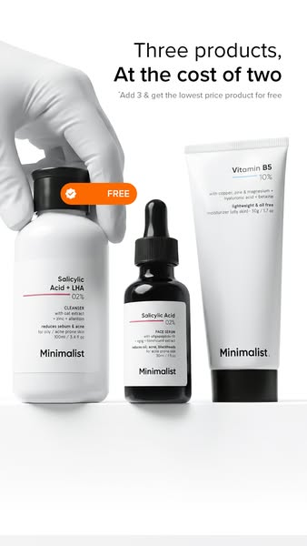

Associated ad copy

Science-backed skincare that fits your budget.
Buy any 2 Minimalist products, get a FREEBIE of your choice!
Simply add your favorites to the cart, select coupon B2G3RDFREE and get the lowest priced item for free.
Buy any 2 products and get a freebie of your choice
Limited Time Offer!
Shop Now

## META-C009

- Library IDs: `1009046391714627`, `4621909734800045`
- Raw records: 2
- Distinct exact image files: 1
- Automated grouping reason: exact-image-hash
- Human decision: **review-group**

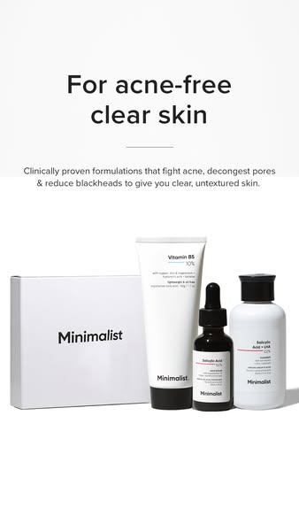

Associated ad copy

Your Simple, Effective Acne Routine
Tired of complicated skincare? This 3-step routine targets acne without overwhelming your skin.
• Cleanse: Controls oil and unclogs pores with Salicylic Acid + LHA 0.2%
• Treat: Reduces active acne with 2% Salicylic Acid serum
• Moisturise: Soothes and strengthens with Vitamin B5 10%
Minimal steps. Maximum clarity.
For skin that feels balanced, clear, and healthy.
Clinically Proven Care
Reward: Cashback
Shop Now

## META-C010

- Library IDs: `1679552263114084`, `1021609566941838`
- Raw records: 2
- Distinct exact image files: 2
- Automated grouping reason: exact-normalized-copy
- Human decision: **review-group**

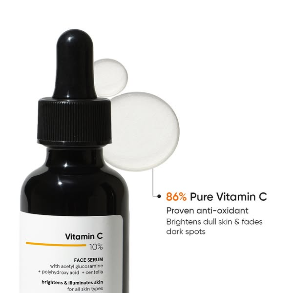

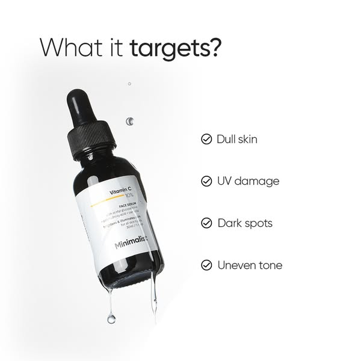

Associated ad copy

Elevate your skincare with Minimalist Vitamin C 10% Serum! 🌟 Target dull skin, UV damage, dark spots, and uneven tone for a glowing, radiant complexion. Plus, enjoy 10% Mcash on every purchase. Glow and save today.
Radiant Skin & 10% Mcash
Brighten your skin and your day with Minimalist Vitamin C 10% Serum. Target key skin concerns and get rewarded with 10% Mcash on every order
Shop Now

## META-C011

- Library IDs: `1702757260767060`, `1041126368361580`
- Raw records: 2
- Distinct exact image files: 5
- Automated grouping reason: exact-normalized-copy, exact-image-hash
- Human decision: **review-group**

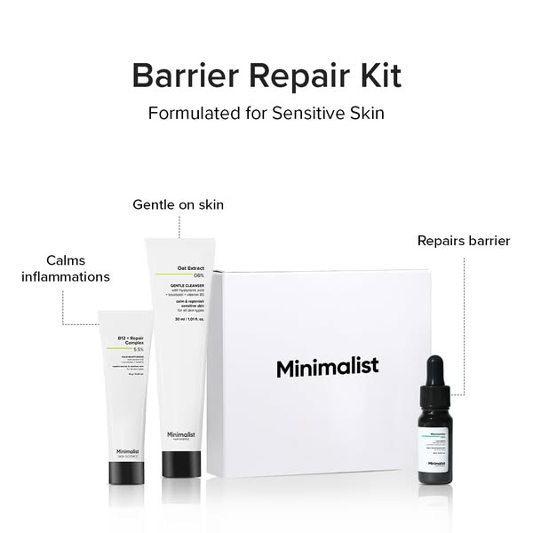

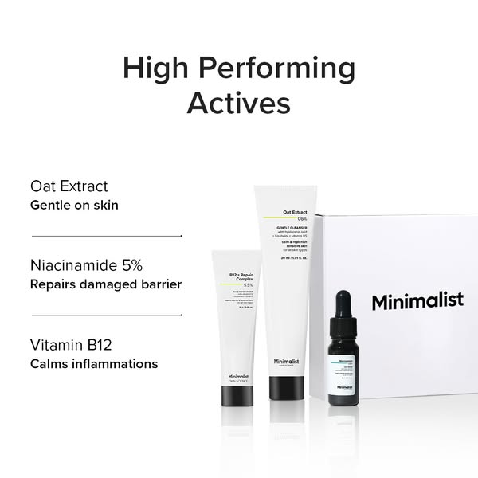

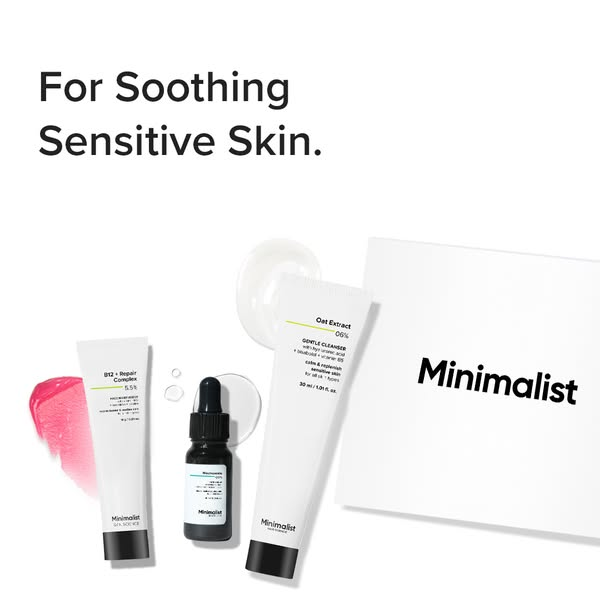

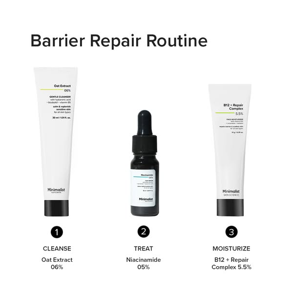

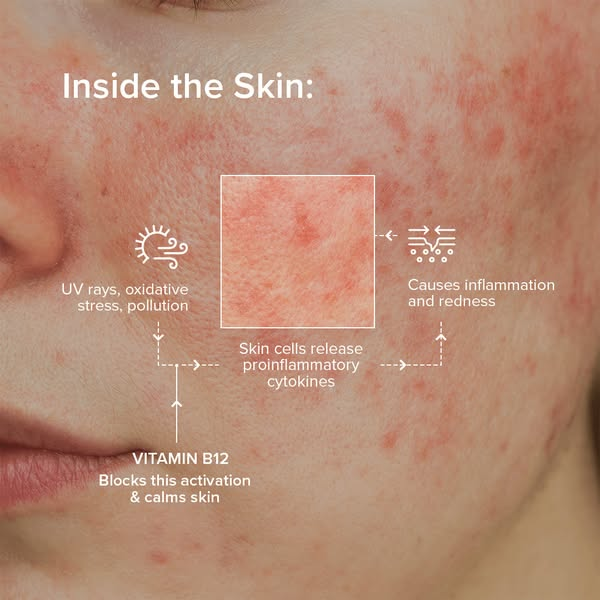

Associated ad copy

Over 80% of users noticed visibly calmer, stronger skin in just 60 days.*
The Minimalist Barrier Repair Routine is powered by:
0.6% Oat Extract — gentle, non-stripping cleanse
5% Niacinamide — clinically proven to repair skin barrier
5.5% B12 Repair Complex — reduces redness and soothes inflammation
Designed for sensitive, stressed, and compromised skin.
3 steps. 2 minutes. 1 visible transformation.
*Based on customer feedback and product testing.
BEMINIMALIST.CO
Earn Cashback! Limited Time offer on kits!
Clinically Backed: 80% Saw Calmer Skin in 60 Days
Shop Now
Clinically Backed: 80% Saw Calmer Skin in 60 Days
BEMINIMALIST.CO
Earn Cashback! Limited Time offer on kits!
Clinically Backed: 80% Saw Calmer Skin in 60 Days
Shop Now
Clinically Backed: 80% Saw Calmer Skin in 60 Days
BEMINIMALIST.CO
Earn Cashback! Limited Time offer on kits!
Clinically Backed: 80% Saw Calmer Skin in 60 Days
Shop Now
Clinically Backed: 80% Saw Calmer Skin in 60 Days
BEMINIMALIST.CO
Earn Cashback! Limited Time offer on kits!
Clinically Backed: 80% Saw Calmer Skin in 60 Days
Shop Now
Clinically Backed: 80% Saw Calmer Skin in 60 Days
BEMINIMALIST.CO
Earn Cashback! Limited Time offer on kits!
Clinically Backed: 80% Saw Calmer Skin in 60 Days
Shop Now
Clinically Backed: 80% Saw Calmer Skin in 60 Days

## META-C012

- Library IDs: `2077897439821938`, `1689065935717430`
- Raw records: 2
- Distinct exact image files: 2
- Automated grouping reason: exact-normalized-copy
- Human decision: **review-group**

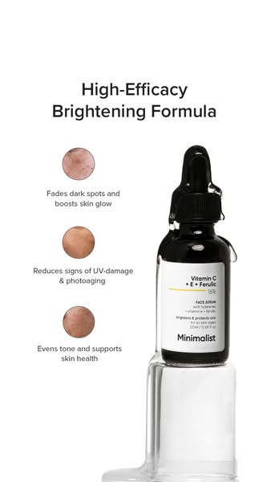

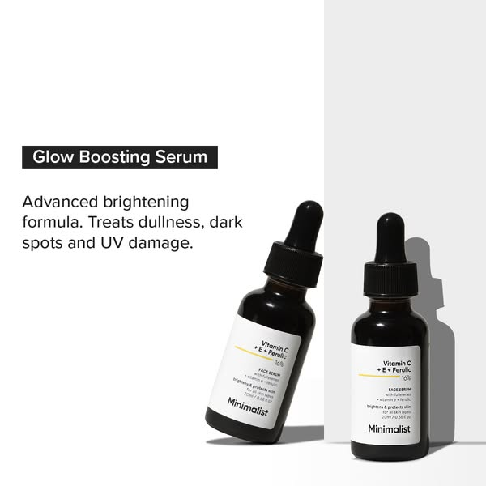

Associated ad copy

Reveal brighter, healthier skin with Minimalist Vitamin C + E + Ferulic Serum. This high-efficacy formula targets dullness, dark spots, and UV damage without feeling heavy or sticky.
- 16% Vitamin C brightens and fades pigmentation
- Ferulic Acid evens skin tone and fights UV damage
- Fullerenes reduce photoaging and enhance antioxidant protection
- Improves texture and supports overall skin health
- Lightweight, fast-absorbing, and non-sticky
Shop now for science-backed skincare that works.
#Minimalist #BrighteningSerum #VitaminC #FerulicAcid #GlowingSkin #CleanBeauty
Earn Cashback on every purchase
Minimalist - Transparent, Hide Nothing
Shop Now

## META-C013

- Library IDs: `2122798398647776`, `1788454339067205`
- Raw records: 2
- Distinct exact image files: 0
- Automated grouping reason: exact-normalized-copy
- Human decision: **review-group**

Associated ad copy

0:00 / 0:31
LINK.BLINKIT.COM
Minimalistinc
Shop online for groceries and get your order delivered to your doorstep. Enjoy delivery of 30,000+ products with Blinkit
Shop Now

## META-C014

- Library IDs: `2325873714613928`, `1723885332163508`
- Raw records: 2
- Distinct exact image files: 2
- Automated grouping reason: exact-normalized-copy
- Human decision: **review-group**

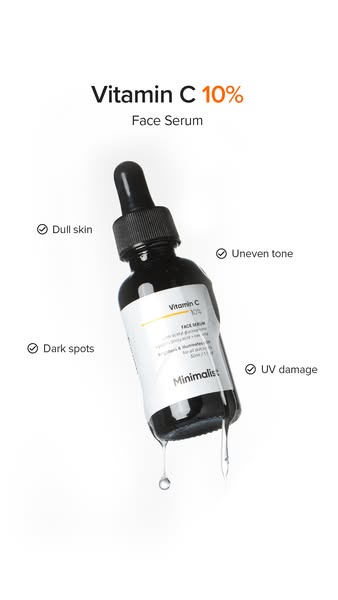

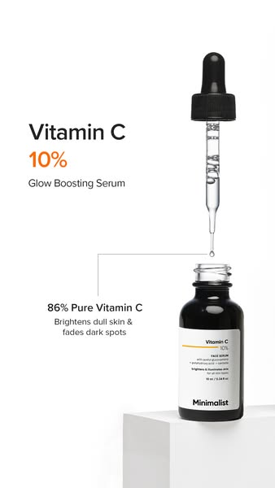

Associated ad copy

Elevate your skincare with Minimalist Vitamin C 10% Serum!
-  Target dull skin
-  Protects from UV damage
-  Fixes dark spots, and uneven tone for a glowing, radiant complexion.
Plus, earn Cashback on every purchase. Glow and save today.
Reward: Cashback
Brighten your Skin
Shop Now

## META-C015

- Library IDs: `1001370322667189`
- Raw records: 1
- Distinct exact image files: 1
- Automated grouping reason: none; singleton
- Human decision: **unreviewed-singleton**

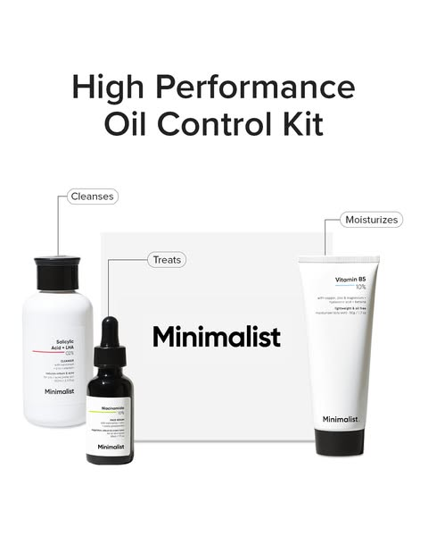

Associated ad copy

Take charge of oily skin with a powerful 3-step routine designed to cleanse, treat, and hydrate — without clogging pores.
• Salicylic Acid + LHA Cleanser – gently exfoliates and unclogs pores to reduce excess oil
• Niacinamide 10% Serum – targets blemishes and regulates sebum production
• Vitamin B5 Moisturizer – lightweight, oil-free hydration to balance skin without greasiness
• Non-comedogenic, fragrance-free, and suitable for all skin types
• Formulated for effective, visible results backed by science
One Kit. Complete Oil Control
Reward: Cashback
Shop Now

## META-C016

- Library IDs: `1005645485589335`
- Raw records: 1
- Distinct exact image files: 1
- Automated grouping reason: none; singleton
- Human decision: **unreviewed-singleton**

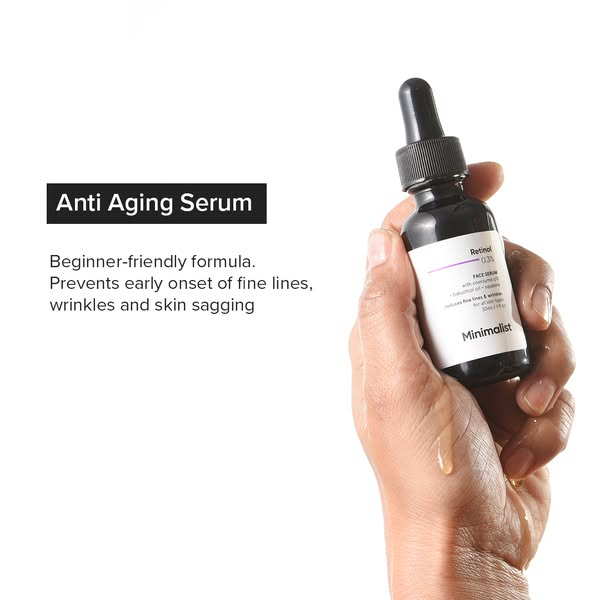

Associated ad copy

Turn back time—gently and effectively.
Minimalist Retinol 0.3% is a beginner-friendly anti-aging serum that helps prevent early signs of aging without irritation.
Smooths fine lines and wrinkles
Prevents skin sagging
Boosts collagen for firmer, younger skin
Powered by Bakuchiol, CoQ10 & Squalane
Light, non-greasy formula for all skin types
Start early. Stay timeless.
Experience visibly younger skin—one drop at a time.
Reward: Cashback
Fine Lines Reduced in Just 30 Days
Shop Now

## META-C017

- Library IDs: `1006278088774514`
- Raw records: 1
- Distinct exact image files: 1
- Automated grouping reason: none; singleton
- Human decision: **unreviewed-singleton**

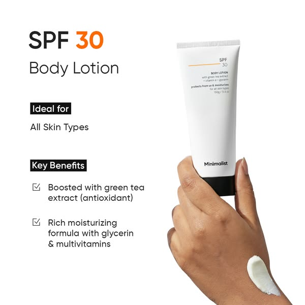

Associated ad copy

Daily sun protection that feels like skincare.
SPF 30 body lotion enriched with green tea, glycerin & multivitamins.
Hydrates, nourishes & shields — for soft, healthy skin all over.
BEMINIMALIST.CO
Guaranteed cashback
SPF 30 that keeps your skin smooth, supple & safe
Shop now

## META-C018

- Library IDs: `1016035757454883`
- Raw records: 1
- Distinct exact image files: 1
- Automated grouping reason: none; singleton
- Human decision: **unreviewed-singleton**

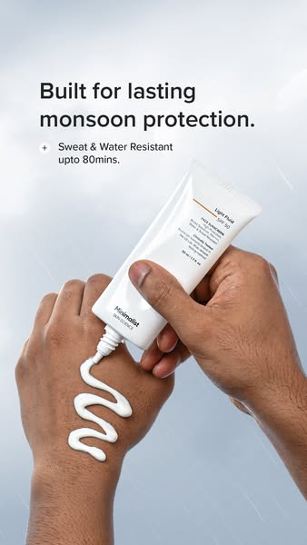

Associated ad copy

"It’s cloudy and raining, so I can skip sunscreen, right?"  Wrong. Up to 80% of UV rays penetrate right through monsoon clouds, causing silent skin damage, pigmentation, and premature aging.
But your regular sunscreen won't survive the rainy season. You need a formula built for the weather.
Meet the Minimalist Light Fluid SPF 50. It’s ultra-lightweight and clinically tested to be sweat and water-resistant for up to 80 minutes. Whether you get caught in a sudden downpour or melt in the humid heat, your sun protection stays completely locked in.
Cloudy Days Don't Block UV Rays
Sweat & water-resistant SPF 50. High protection, zero white cast.
Shop Now

## META-C019

- Library IDs: `1029164189491237`
- Raw records: 1
- Distinct exact image files: 1
- Automated grouping reason: none; singleton
- Human decision: **unreviewed-singleton**

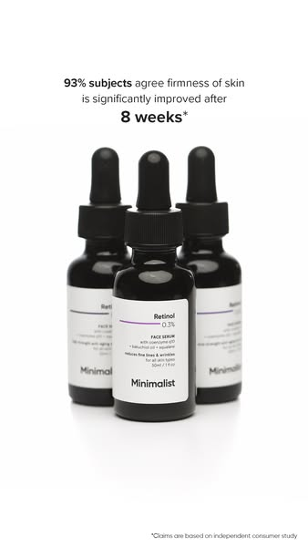

Associated ad copy

Reveal younger, smoother skin—safely and effectively.
Minimalist Retinol 0.3% is beginner-friendly and formulated with Bakuchiol, CoQ10, and Squalane to deliver visible results without irritation.
- Reduces fine lines and wrinkles
- 93% users reported firmer skin in 8 weeks*
- Fades acne scars and improves texture
- Lightweight, non-comedogenic, and suits all skin types
Thousands have made the switch. Now it's your turn.
Try Minimalist Retinol and see the difference.
Reward: Cashback
Fine Lines Reduced in Just 30 Days
Shop Now

## META-C020

- Library IDs: `1030603056584596`
- Raw records: 1
- Distinct exact image files: 1
- Automated grouping reason: none; singleton
- Human decision: **unreviewed-singleton**

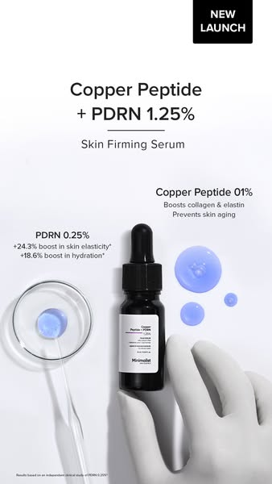

Associated ad copy

New Launch :
Copper Peptide + PDRN 1.25% Skin Firming Serum
+24.3% boost in skin elasticity*
+18.6% boost in hydration*
Powered by Sodium DNA (PDRN) 0.25% and Copper Peptide 1%, this serum restores elasticity, boosts collagen & elastin, and helps prevent skin aging.
Firm. Hydrate. Revive.
Earn cashback on every purchase
Your Anti-Aging Secret is here
Shop Now

## META-C021

- Library IDs: `1043380451363992`
- Raw records: 1
- Distinct exact image files: 1
- Automated grouping reason: none; singleton
- Human decision: **unreviewed-singleton**

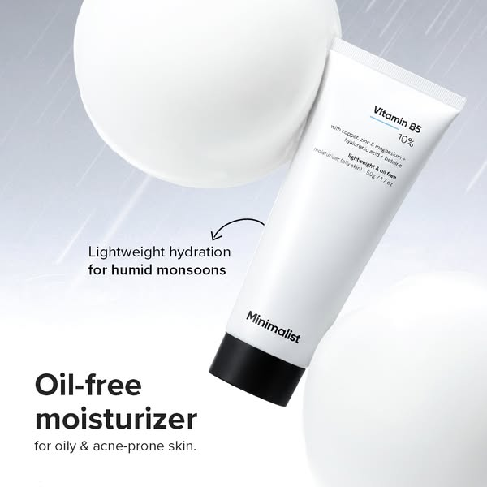

Associated ad copy

Humid weather making your regular moisturizer feel like a sticky mess? Time to ditch the heavy creams.
Give your skin the lightweight hydration it craves with Minimalist Vitamin B5 10% Moisturizer. Formulated for oily and acne-prone skin types, this oil-free gel formula delivers intense nourishment while keeping your face fresh, matte, and comfortable all through the rainy season.
Don't let the monsoon humidity trigger your breakouts. Upgrade your skincare routine today.
Zero Grease. Just Lightweight Hydration.
Oil-free gel moisturizer. Perfect for oily & acne-prone skin.
Shop Now

## META-C022

- Library IDs: `1048233921490090`
- Raw records: 1
- Distinct exact image files: 1
- Automated grouping reason: none; singleton
- Human decision: **unreviewed-singleton**

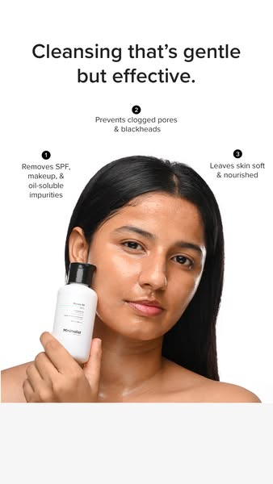

Associated ad copy

Formulated with Marula, Jojoba & Olive oils, this cleanser breaks down even waterproof makeup — while maintaining your skin’s natural moisture.
5% Marula Oil for a Non-Drying Cleanse
Gently removes oils & impurities, leaves skin clean
Shop Now

## META-C023

- Library IDs: `1069586518930107`
- Raw records: 1
- Distinct exact image files: 1
- Automated grouping reason: none; singleton
- Human decision: **unreviewed-singleton**

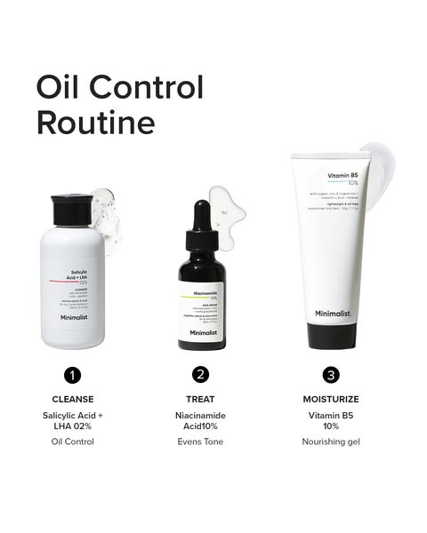

Associated ad copy

Say goodbye to excess oil and breakouts with a dermatologist-approved 3-step routine designed for balanced, healthy-looking skin.
• Step 1 – Cleanse: Salicylic Acid + LHA 02%
Deep cleanses pores & controls oil without over-drying
• Step 2 – Treat: Niacinamide 10% Serum
Fades blemishes, evens out skin tone & reduces sebum
• Step 3 – Moisturize: Vitamin B5 10% Gel
Lightweight, oil-free hydration that nourishes & soothes
• Non-comedogenic. Fragrance-free. Ideal for oily and acne-prone skin
• Backed by science. Loved by skin.
Your 3-Step Routine for Shine-Free, Healthy Skin
Reward: Cashback
Shop Now

## META-C024

- Library IDs: `1091140040069984`
- Raw records: 1
- Distinct exact image files: 1
- Automated grouping reason: none; singleton
- Human decision: **unreviewed-singleton**

Associated ad copy

Minimalist Retinol 0.3% – Your Beginner-Friendly Anti-Aging Solution
• Reduces early signs of aging – fine lines, wrinkles & sagging
• Improves skin texture and fades acne scars
• Lightweight, non-greasy and absorbs quickly
• Gentle formula with Coenzyme Q10, Bakuchiol & Squalane
• Suitable for all skin types, even sensitive skin
Real reviews, real results:
“Very lightweight, no irritation, must try.” – Swastika G.
“Texture is smoother, scars visibly reduced in 3 months.” – Muskan D.
Experience the power of clinically backed skincare.
Try Minimalist Retinol 0.3% today.
#MinimalistSkincare #RetinolSerum #AntiAgingCare #SkinThatGlows #CleanEffectiveBeauty
Start Your Anti-Aging Routine with Minimalist Retinol
Reduce Fine Lines & Scars with Retinol 0.3%
Shop Now

## META-C025

- Library IDs: `1248566807253131`
- Raw records: 1
- Distinct exact image files: 3
- Automated grouping reason: none; singleton
- Human decision: **unreviewed-singleton**

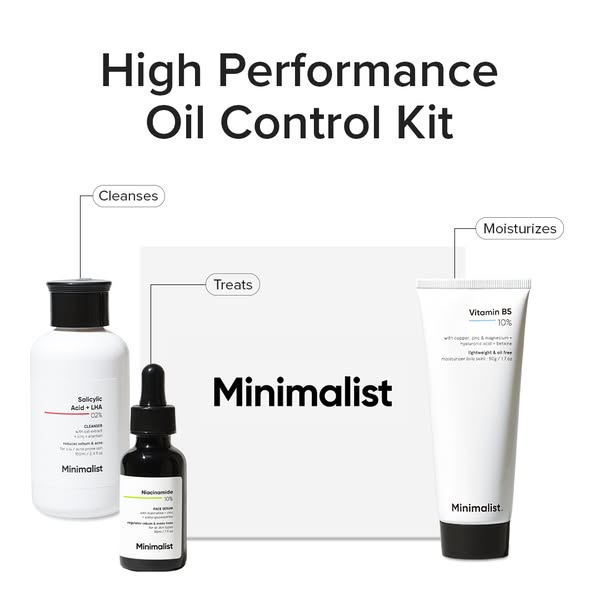

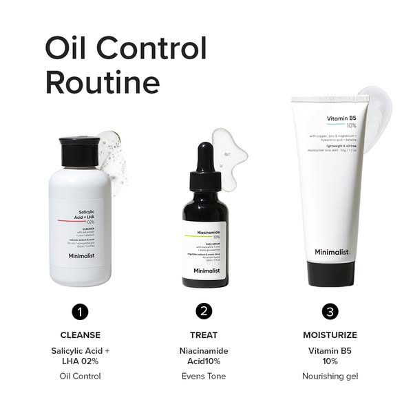

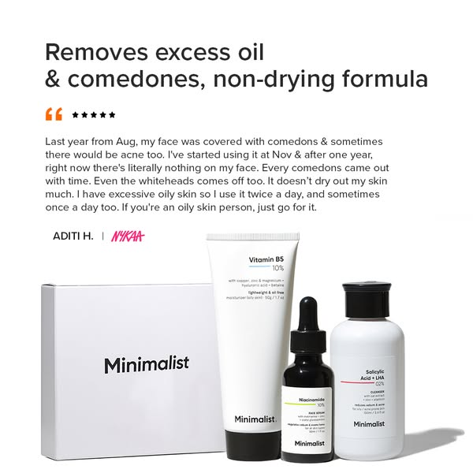

Associated ad copy

Say goodbye to excess oil and breakouts with a dermatologist-approved 3-step routine designed for balanced, healthy-looking skin.
• Step 1 – Cleanse: Salicylic Acid + LHA 02%
Deep cleanses pores & controls oil without over-drying
• Step 2 – Treat: Niacinamide 10% Serum
Fades blemishes, evens out skin tone & reduces sebum
• Step 3 – Moisturize: Vitamin B5 10% Gel
Lightweight, oil-free hydration that nourishes & soothes
• Non-comedogenic. Fragrance-free. Ideal for oily and acne-prone skin
• Backed by science. Loved by skin.
BEMINIMALIST.CO
Your 3-Step Routine for Shine-Free, Healthy Skin
Reward: Cashback
Shop Now
Reward: Cashback
BEMINIMALIST.CO
Your 3-Step Routine for Shine-Free, Healthy Skin
Reward: Cashback
Shop Now
Reward: Cashback
BEMINIMALIST.CO
Your 3-Step Routine for Shine-Free, Healthy Skin
Reward: Cashback
Shop Now
Reward: Cashback

## META-C026

- Library IDs: `1357518779895338`
- Raw records: 1
- Distinct exact image files: 1
- Automated grouping reason: none; singleton
- Human decision: **unreviewed-singleton**

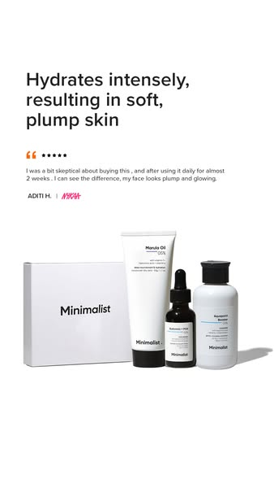

Associated ad copy

Transform your skin with a hydration routine trusted by thousands. Clinically formulated to deeply moisturize, restore skin health, and bring back your glow.
• Aquaporin Booster Cleanser – gently cleanses while maintaining moisture balance
• Hyaluronic + PGA Serum – offers intense hydration and improves skin texture
• Marula Oil Moisturizer – nourishes deeply, leaving skin soft, plump, and glowing
• Suitable for dry, flaky, or dull skin
• Non-comedogenic. Fragrance-free. Proven by real users
“After just 2 weeks, my face looks plump and glowing.” – Aditi H., Verified Nykaa Customer
Gowing skin in Just 2 Weeks
Earn Cashback! Limited Time offer on kits!
Shop Now

## META-C027

- Library IDs: `1373312194709433`
- Raw records: 1
- Distinct exact image files: 1
- Automated grouping reason: none; singleton
- Human decision: **unreviewed-singleton**

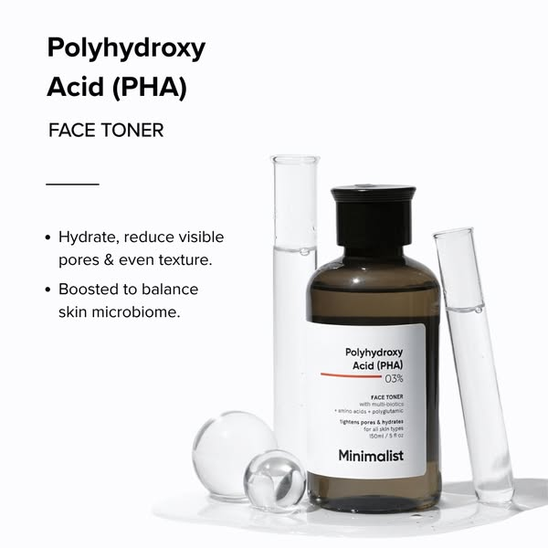

Associated ad copy

Ditch harsh exfoliators for a smarter way to tone! 🌿
Meet the Minimalist PHA 03% Face Toner, powered by gentle actives and infused Prebiotics & Probiotics that protect and balance your skin microbiome.
Hydrate, Tighten Pores & Even Texture
Gentle 3% PHA Toner with Multi-Biotics.
Shop Now

## META-C028

- Library IDs: `1373614864690172`
- Raw records: 1
- Distinct exact image files: 1
- Automated grouping reason: none; singleton
- Human decision: **unreviewed-singleton**

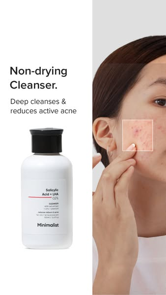

Associated ad copy

A gentle yet powerful daily cleanser formulated with 2% BHA + LHA to exfoliate, fight acne, and control excess oil — without over-drying.
Why You'll Love It:
Clears pores and gently exfoliates
Reduces and prevents breakouts
Helps manage oil production
Ideal for: All skin types, especially oily and acne-prone skin.
Redeem mCash for additional discounts
Exfoliate Daily, Fight Acne Gently
Shop Now

## META-C029

- Library IDs: `1539660707084980`
- Raw records: 1
- Distinct exact image files: 1
- Automated grouping reason: none; singleton
- Human decision: **unreviewed-singleton**

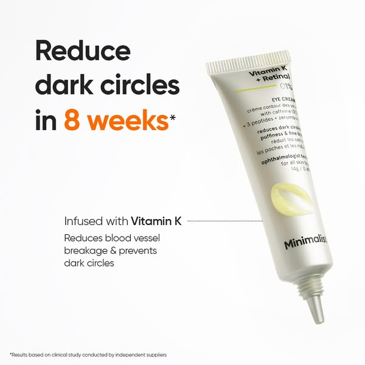

Associated ad copy

👀 Dark Circles? Puffiness? Tired Eyes? Not anymore! Say hello to brighter, refreshed under-eyes in just 8 weeks with our clinically tested Vitamin K + Retinol Eye Cream. ✨
✅ Reduces dark circles & puffiness
✅ Prevents blood vessel breakage
✅ Infused with Vitamin K & Retinol for maximum repair
Thousands are already loving it! Are you next? Tap below & try it for yourself! ⬇️
Erase Dark Circles & Puffiness – Fast!
Your under-eye glow-up starts NOW! Brighten, smooth, and refresh your skin with every use. Shop now!
Shop Now

## META-C030

- Library IDs: `1551026110079477`
- Raw records: 1
- Distinct exact image files: 1
- Automated grouping reason: none; singleton
- Human decision: **unreviewed-singleton**

Associated ad copy

Struggling with redness, sensitivity, or a weakened skin barrier?
The Minimalist Barrier Repair Routine delivers real results with high-performing actives:
Oat Extract for gentle cleansing
5% Niacinamide to repair damaged skin
Vitamin B12 Complex to calm inflammation
Simple. Effective. Backed by science.
Cleanse. Treat. Moisturize. Restore confidence in your skin.
Earn Cashback! Limited Time offer on kits!
Restore, Soothe, Strengthen — Your Skin Barrier Deserves It
Shop Now

## META-C031

- Library IDs: `1571114231310679`
- Raw records: 1
- Distinct exact image files: 1
- Automated grouping reason: none; singleton
- Human decision: **unreviewed-singleton**

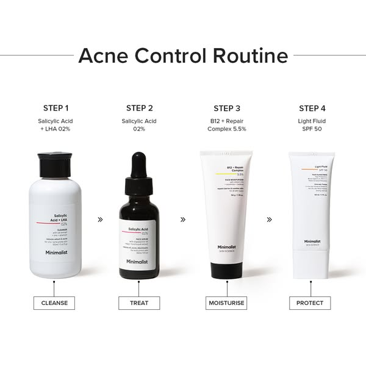

Associated ad copy

Struggling with breakouts, blackheads, or oily skin?
This 4-step, dermatologist-backed routine targets acne at every stage — and the Salicylic Acid 2% Serum is the real game-changer.
Step 1: Cleanse
Salicylic + LHA clears surface buildup and unclogs pores from the start.
Step 2: Treat
Our hero step — Salicylic Acid 2% Serum goes deeper to exfoliate inside pores, reduce blackheads, and calm active acne.
Powered by White Horehound & EGCG for clinically proven results:
- 50% reduction in blackheads in just 28 days
- Controls excess oil
- Prevents future breakouts
Step 3: Moisturise
B12 + Repair Complex heals and strengthens your skin barrier — essential after exfoliation.
Step 4: Protect
SPF 50 Light Fluid shields your skin from sun-triggered acne and dark spots.
Try the full routine and finally get control over acne — without the guesswork.
From Clogged Pores to Clear Skin – Fast
Earn Cashback on every Purchase
Shop Now

## META-C032

- Library IDs: `1578756280490721`
- Raw records: 1
- Distinct exact image files: 1
- Automated grouping reason: none; singleton
- Human decision: **unreviewed-singleton**

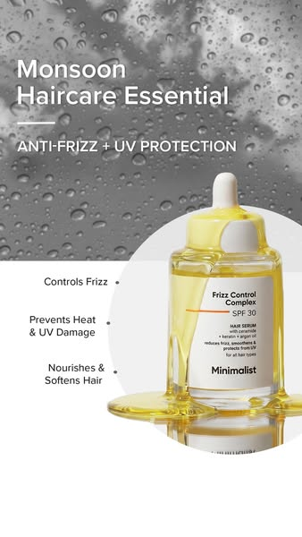

Associated ad copy

Monsoon humidity vs. your hair? Make it a fair fight.
The Minimalist Frizz Control Complex SPF 30 is your non-greasy, daily essential to tame stubborn frizz, block out moisture-heavy air, and protect your hair from UV damage. Just a few drops for instantly smooth, glossy, and manageable hair—no matter how high the humidity climbs.
The Ultimate Monsoon Hair Shield
Frizz Control + SPF 30 for smooth, protected hair
Shop Now

## META-C033

- Library IDs: `1578993020436450`
- Raw records: 1
- Distinct exact image files: 4
- Automated grouping reason: none; singleton
- Human decision: **unreviewed-singleton**

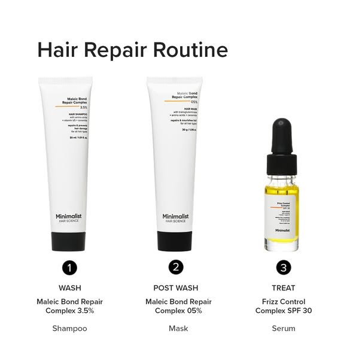

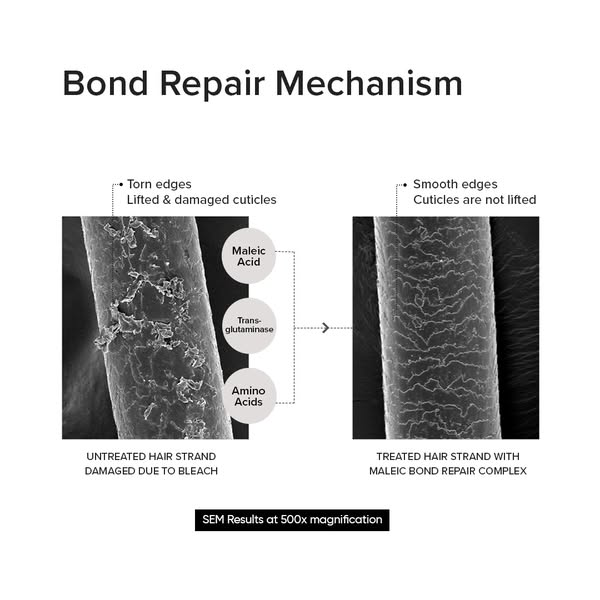

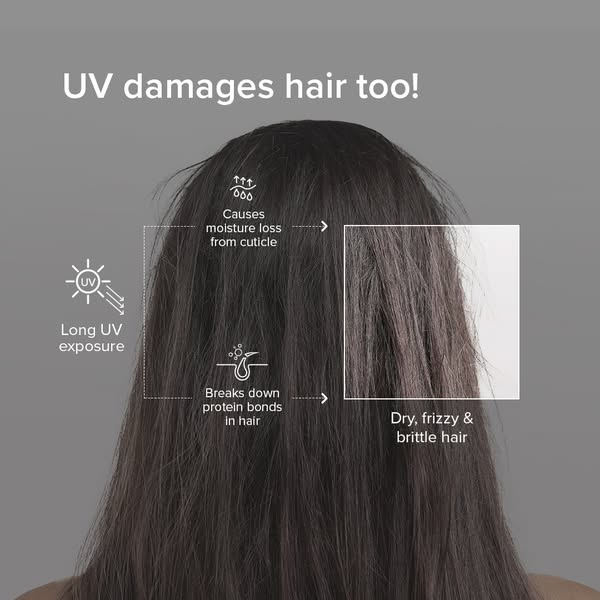

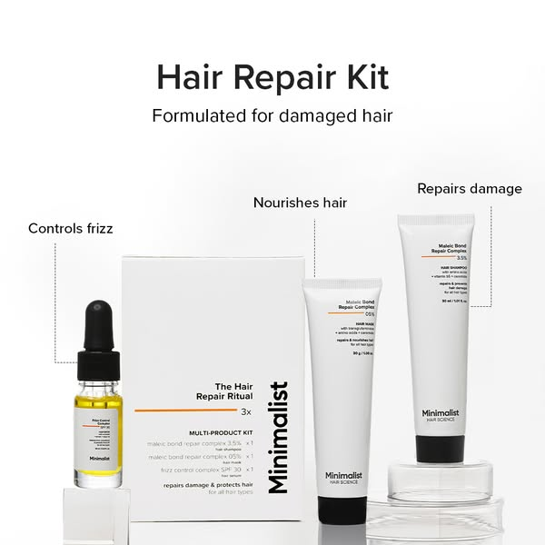

Associated ad copy

Frizz-Free, Stronger Hair in 3 Steps.
Repair damage, smooth cuticles & protect from UV — all in one powerful routine.
Step 1: Cleanse with Bond-Repair Shampoo
Step 2: Deep Repair with Bond-Repair Mask
Step 3: Shield & Smooth with Frizz Control Serum (SPF 30)
Healthier, shinier hair starts with science.
Minimalist Hair Repair Ritual Kit — because real repair is a routine.
BEMINIMALIST.CO
Earn Cashback! Limited Time Offer on Kits!
Frizz-Free Results in 3 Uses or Less
Shop Now
Frizz-Free Results in 3 Uses or Less
BEMINIMALIST.CO
Earn Cashback! Limited Time Offer on Kits!
Frizz-Free Results in 3 Uses or Less
Shop Now
Frizz-Free Results in 3 Uses or Less
BEMINIMALIST.CO
Earn Cashback! Limited Time Offer on Kits!
Frizz-Free Results in 3 Uses or Less
Shop Now
Frizz-Free Results in 3 Uses or Less
BEMINIMALIST.CO
Earn Cashback! Limited Time Offer on Kits!
Frizz-Free Results in 3 Uses or Less
Shop Now
Frizz-Free Results in 3 Uses or Less

## META-C034

- Library IDs: `1601372358661756`
- Raw records: 1
- Distinct exact image files: 1
- Automated grouping reason: none; singleton
- Human decision: **unreviewed-singleton**

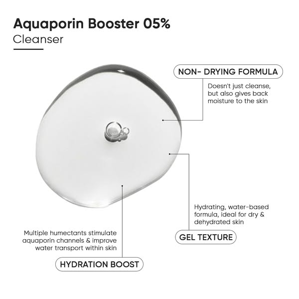

Associated ad copy

Minimalist Aquaporin Booster 05% Cleanser
Hydrate As You Cleanse
A gentle, water-based cleanser powered by 5% Aquaporin Boosters to deeply hydrate while washing away dirt and impurities. Formulated with humectants that enhance water movement within the skin—perfect for dry and dehydrated skin types.
What Makes It Special:
Non-drying formula that restores skin moisture
Boosts hydration by activating aquaporin channels
Lightweight gel texture, ideal for daily use
Clean. Hydrate. Refresh.
By Minimalist — Skincare rooted in science.
BEMINIMALIST.CO
Reward: Cashback
Brighten, Exfoliate, Glow
Shop now

## META-C035

- Library IDs: `1666346887762261`
- Raw records: 1
- Distinct exact image files: 1
- Automated grouping reason: none; singleton
- Human decision: **unreviewed-singleton**

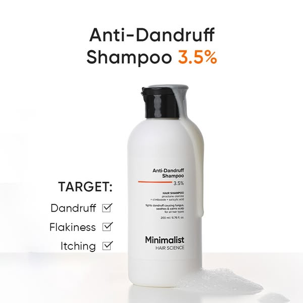

Associated ad copy

Tired of stubborn dandruff that keeps coming back? Minimalist Anti-Dandruff Shampoo (3.5%) is here to rescue your scalp! Powered by science-backed ingredients, it fights dandruff at the root while keeping your hair fresh and healthy.
✔ 3.5% Active Formula – Powered by Climbazole & Salicylic Acid to fight dandruff effectively.
✔ Targets Dandruff at the Root – Eliminates fungi and soothes irritation for long-lasting relief.
✔ Gentle Yet Powerful – Cleanses without drying out your scalp or hair.
✔ Visible Results, Fast – Experience a noticeable reduction in flakes within weeks.
✔ Science-Backed & Dermatologist Tested – Safe for all scalp types, including sensitive skin.
Shop Now & Enjoy Flake-Free Hair!
BEMINIMALIST.CO
No More Flakes, Just Healthy Hair! Cashback awaits!
Hide Nothing
Shop now

## META-C036

- Library IDs: `1698731678103428`
- Raw records: 1
- Distinct exact image files: 1
- Automated grouping reason: none; singleton
- Human decision: **unreviewed-singleton**

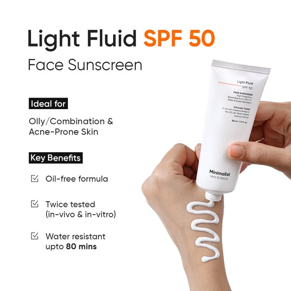

Associated ad copy

Minimalist Light Fluid SPF 50
Light on Skin, Strong on Protection
Designed for oily, combination, and acne-prone skin, this oil-free sunscreen offers broad-spectrum SPF 50 protection with a weightless finish.
Key Benefits:
Oil-free and non-comedogenic
Clinically tested (in-vivo & in-vitro)
Water-resistant up to 80 minutes
Minimalist. Skincare that works.
BEMINIMALIST.CO
Guaranteed cashback
Minimalist. Science-led skincare you can trust.
Shop now

## META-C037

- Library IDs: `1700335027907222`
- Raw records: 1
- Distinct exact image files: 1
- Automated grouping reason: none; singleton
- Human decision: **unreviewed-singleton**

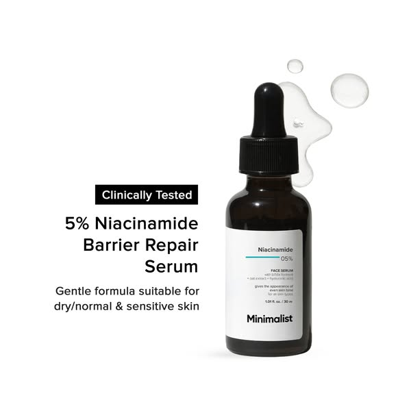

Associated ad copy

Your skin isn’t generic; your skincare shouldn’t be either.
Create a custom bundle based on your skin type & concerns.Pick what your skin actually needs, skip what it doesn’t.
- Made for All skin type.
- Beginner-friendly routines
- Science-backed formulas because every skin is unique.
BEMINIMALIST.CO
Minimalistinc
We believe our products should be accessible to all, but we will never compromise on quality, ensuring only the best products reach you. Our products are priced to allow you to test and play with ingredients to build your perfect skincare or haircare routine, for your ever changing needs.
Shop Now

## META-C038

- Library IDs: `1713183573258042`
- Raw records: 1
- Distinct exact image files: 1
- Automated grouping reason: none; singleton
- Human decision: **unreviewed-singleton**

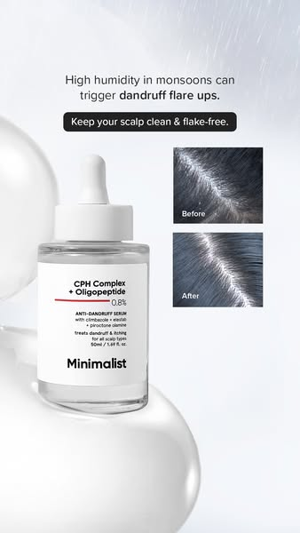

Associated ad copy

Is your regular shampoo failing you this monsoon?
High humidity creates the perfect breeding ground for Malassezia (the fungus responsible for dandruff).
Upgrade your routine with our targeted Anti-Dandruff Serum. Formulated with CPH Complex + Oligopeptide, it doesn't just wash away flakes temporarily—it treats the root cause of itching and irritation.
- Lightweight & non-sticky
- Suitable for all scalp types
- Visible results
Say Goodbye to Monsoon Flakes
Shop Minimalist Anti-Dandruff Serum today
Shop Now

## META-C039

- Library IDs: `1730877928245550`
- Raw records: 1
- Distinct exact image files: 1
- Automated grouping reason: none; singleton
- Human decision: **unreviewed-singleton**

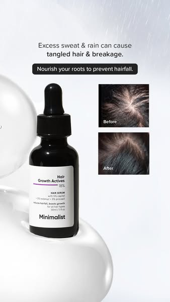

Associated ad copy

Rain outside, hairfall inside?  Monsoon humidity can severely weaken your hair roots, leading to extra breakage and shedding every time you detangle.
Nourish your roots and protect your strands with Minimalist Hair Growth Actives 18% Serum. Just a few drops a day helps reduce hairfall, activates hair stem cells, and boosts overall density.
Nourish Roots, Prevent Hairfall
Powerhouse blend of Capixyl, Redensyl & Procapil
Shop Now

## META-C040

- Library IDs: `1979874489349335`
- Raw records: 1
- Distinct exact image files: 1
- Automated grouping reason: none; singleton
- Human decision: **unreviewed-singleton**

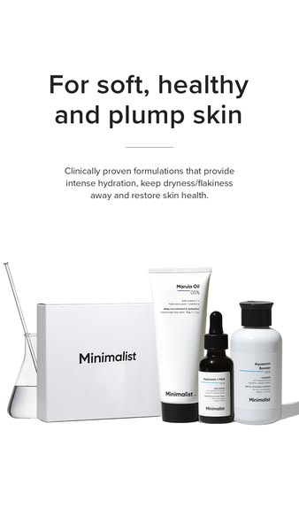

Associated ad copy

Revive dry, flaky skin with this clinically proven hydration kit that deeply nourishes, restores skin barrier function, and leaves your skin soft, smooth, and glowing.
• Aquaporin Booster Cleanser (0.5%) – gently cleanses without stripping essential moisture
• Hyaluronic + PGA Serum (2%) – provides multi-level hydration and boosts water retention
• Marula Oil Moisturizer (0.5%) – rich in antioxidants and vitamins for intense nourishment
• Strengthens the skin barrier and prevents moisture loss
• Ideal for dry, dehydrated, or sensitized skin
• Fragrance-free. Dermatologist-tested. Powered by science
Earn Cashback! Limited Time offer on kits!
Goodbye Dryness. Hello Hydrated Glow.
Shop Now

## META-C041

- Library IDs: `2109457459783680`
- Raw records: 1
- Distinct exact image files: 1
- Automated grouping reason: none; singleton
- Human decision: **unreviewed-singleton**

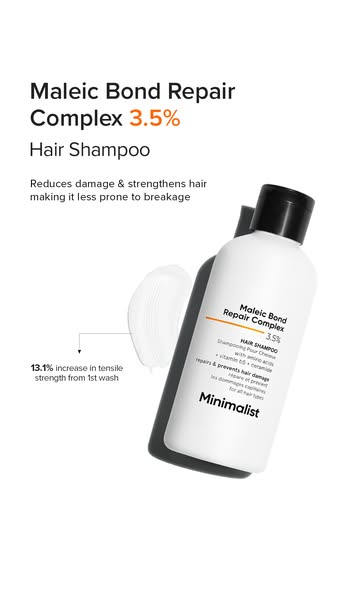

Associated ad copy

Stronger Hair Starts in Just 1 Wash
Clinically backed with 3.5% Maleic Bond Repair Complex, this shampoo targets damage from within and restores hair strength from the first use.
Key Benefits:
- Increases tensile strength by 13.1% after 1st wash
- Reduces breakage by up to 28% in 2 weeks
- Repairs broken hair bonds with maleic acid
- Nourishes deeply with Vitamin B5 and ceramides
- Improves resistance to heat and chemical damage over time
Shop Now and say goodbye to fragile locks
Repair Damage in Just 1 Wash with 3.5% Bond Complex
Earn cashback on every purchase
Shop Now

## META-C042

- Library IDs: `2315278469241947`
- Raw records: 1
- Distinct exact image files: 1
- Automated grouping reason: none; singleton
- Human decision: **unreviewed-singleton**

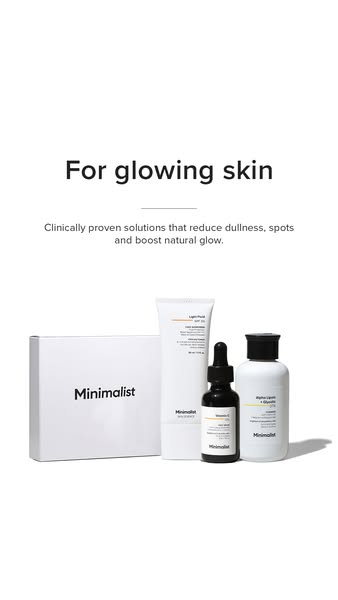

Associated ad copy

Reveal Your Natural Glow with Minimalist
Tired of dull, uneven skin? Discover the clinically proven Glow Boosting Routine from Minimalist. Designed to brighten, treat, and protect—backed by science, made for real results.
Step 1: Cleanse – Alpha Lipoic + Glycolic 07%
Gently exfoliates and brightens the skin.
Step 2: Treat – Vitamin C 10% Serum
Boosts glow, evens skin tone, and reduces dark spots.
Step 3: Protect – Light Fluid SPF 50
High-protection sunscreen with PA++++ to prevent sun damage.
Minimal ingredients. Maximum results.
Fragrance-free. Dermatologically tested. For all skin types.
Shop now and unlock visibly healthier, glowing skin.
Earn Cashback! Limited Time offer on kits!
Reduce Dullness and Boost Your Natural Radiance
Shop Now

## META-C043

- Library IDs: `2409542152889169`
- Raw records: 1
- Distinct exact image files: 1
- Automated grouping reason: none; singleton
- Human decision: **unreviewed-singleton**

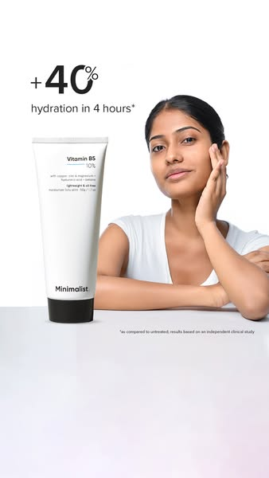

Associated ad copy

An everyday moisturizer for hydrating, nourishing and repairing skin. A lightweight, oil-free product with high concentration of Vitamin B5 (Panthenol), formulated especially for oily / combination skin.
Redeem mCash for additional discount!
This winter your skin needs extra care
Shop Now

## META-C044

- Library IDs: `2422634991565984`
- Raw records: 1
- Distinct exact image files: 1
- Automated grouping reason: none; singleton
- Human decision: **unreviewed-singleton**

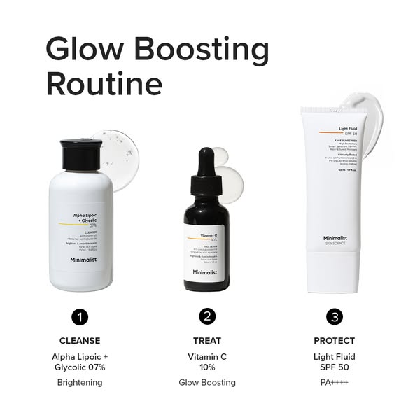

Associated ad copy

Reveal Your Natural Glow with Minimalist
Tired of dull, uneven skin? Discover the clinically proven Glow Boosting Routine from Minimalist. Designed to brighten, treat, and protect—backed by science, made for real results.
Step 1: Cleanse – Alpha Lipoic + Glycolic 07%
Gently exfoliates and brightens the skin.
Step 2: Treat – Vitamin C 10% Serum
Boosts glow, evens skin tone, and reduces dark spots.
Step 3: Protect – Light Fluid SPF 50
High-protection sunscreen with PA++++ to prevent sun damage.
Minimal ingredients. Maximum results.
Fragrance-free. Dermatologically tested. For all skin types.
Shop now and unlock visibly healthier, glowing skin.
BEMINIMALIST.CO
Earn Cashback! Limited Time offer on kits!
Reduce Dullness and Boost Your Natural Radiance
Shop now

## META-C045

- Library IDs: `2488959061608431`
- Raw records: 1
- Distinct exact image files: 1
- Automated grouping reason: none; singleton
- Human decision: **unreviewed-singleton**

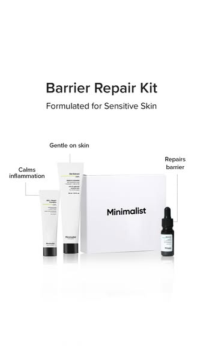

Associated ad copy

Say goodbye to redness, sensitivity & a weakened skin barrier!
Our Minimalist Barrier Repair Routine combines:
• Gentle oat extract cleansing
• 5% niacinamide for damaged skin repair
• Vitamin B12 complex to calm inflammation
Backed by science. Restore confidence in your skin! Get started now
Earn Cashback! Limited Time offer on kits!
Restore, Soothe, Strengthen — Your Skin Barrier Deserves It
Shop Now

## META-C046

- Library IDs: `27462695426715869`
- Raw records: 1
- Distinct exact image files: 1
- Automated grouping reason: none; singleton
- Human decision: **unreviewed-singleton**

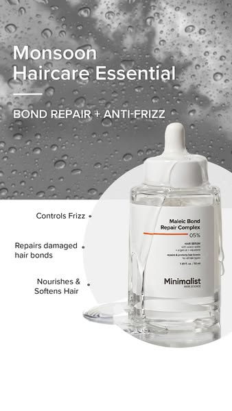

Associated ad copy

Tired of hair that turns into a puffy, unruly mess the second you step outside? Severe humidity is the ultimate test for your hair strength.
Get the ultimate monsoon shield with our Maleic Bond Repair Complex 05% Hair Serum. It offers a powerful dual-action formula that handles your two biggest rainy season complaints: it repairs damaged hair bonds while acting as an anti-frizz shield.
Get smooth, resilient, and healthy hair that doesn't let the weather get the best of it.
Don't Just Mask Frizz. Repair It
Formulated with Maleic Acid, Amino Acids & Argan Oil
Shop Now

## META-C047

- Library IDs: `3897957970511094`
- Raw records: 1
- Distinct exact image files: 1
- Automated grouping reason: none; singleton
- Human decision: **unreviewed-singleton**

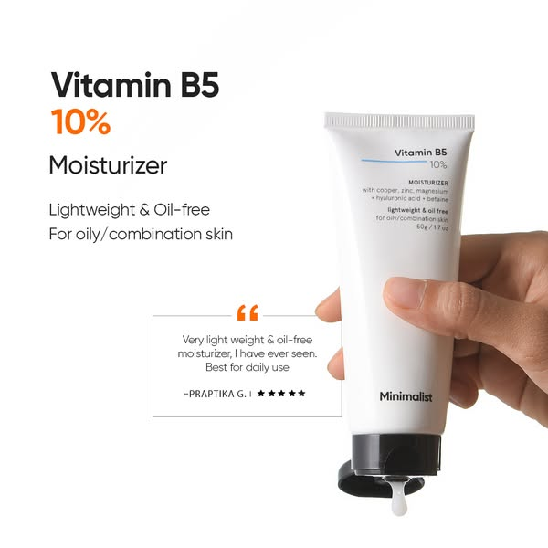

Associated ad copy

An everyday moisturizer for hydrating, nourishing and repairing skin. A lightweight, oil-free product with high concentration of Vitamin B5 (Panthenol), formulated especially for oily / combination skin.
Hydration, Repair & Cashback
Reward: Cashback
Shop Now

## META-C048

- Library IDs: `4611729382383720`
- Raw records: 1
- Distinct exact image files: 1
- Automated grouping reason: none; singleton
- Human decision: **unreviewed-singleton**

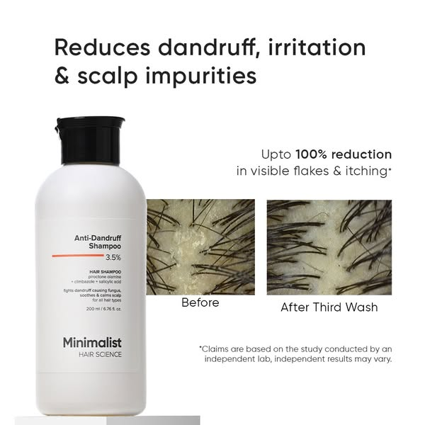

Associated ad copy

Struggling with dandruff and an itchy scalp? See the difference in just 3 washes with Minimalist Anti-Dandruff Shampoo! ✨
🔴 Before: Visible flakes, constant itching, and scalp buildup.
🟢 After: Up to 100% reduction in flakes & itching, a clean and healthy scalp.
🔴 Before: Dandruff-causing fungi & irritation.
🟢 After: Climbazole + Salicylic Acid work to cleanse, soothe, and restore scalp health.
🔴 Before: Harsh shampoos that strip moisture.
🟢 After: Gentle yet powerful formula, safe for all hair types.
Experience the transformation – Try it now!
BEMINIMALIST.CO
Flaky Scalp? Not Anymore! See the Difference in Just 3 Washes!
Transparency is the key
Shop now

## META-C049

- Library IDs: `870778455827585`
- Raw records: 1
- Distinct exact image files: 1
- Automated grouping reason: none; singleton
- Human decision: **unreviewed-singleton**

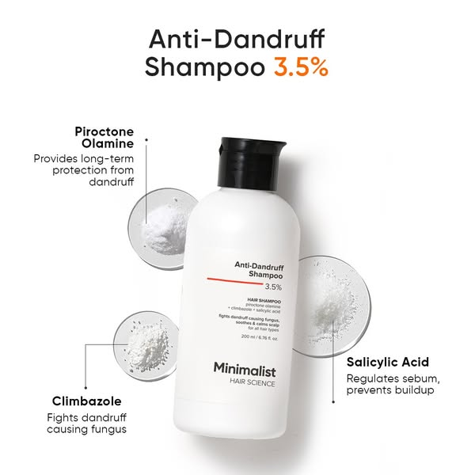

Associated ad copy

Say goodbye to dandruff with Minimalist Anti-Dandruff Shampoo (3.5%)—a powerful formula backed by science to fight flakes, itchiness, and scalp buildup.
✔ Piroctone Olamine – Provides long-term protection from dandruff.
✔ Climbazole – Fights dandruff-causing fungus at the root.
✔ Salicylic Acid – Regulates sebum & prevents buildup for a healthier scalp.
🔬 Clinically Proven | Gentle Yet Effective | Visible Results
Get yours today & experience the difference!
BEMINIMALIST.CO
Flaky Scalp? Not Anymore! See the Difference in Just 3 Washes!
Transparency is the key
Shop now

## META-C050

- Library IDs: `896197086383625`
- Raw records: 1
- Distinct exact image files: 1
- Automated grouping reason: none; singleton
- Human decision: **unreviewed-singleton**

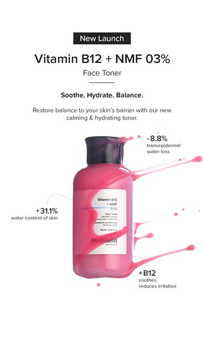

Associated ad copy

VitaminB12 + NMF 03% Face Toner:
A toner your routine was waiting for.
+31.1% increase in skin’s water content
-8.8% transepidermal water loss
B12 to soothe & reduce irritation
Hydration that shows. Barrier care that lasts.
Shop the New Vitamin B12 + NMF 03% Toner today.
New Vitamin B12 + NMF Toner for Deep Hydration
Redeem mCash for additional discount!
Shop Now

## META-C051

- Library IDs: `993093336978376`
- Raw records: 1
- Distinct exact image files: 1
- Automated grouping reason: none; singleton
- Human decision: **unreviewed-singleton**

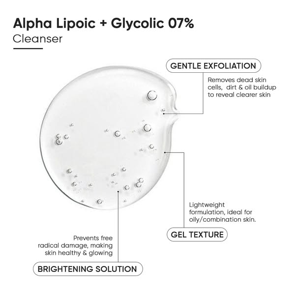

Associated ad copy

This gel-based daily cleanser combines 7% Glycolic Acid and Alpha Lipoic Acid to gently exfoliate, clear buildup, and reveal visibly brighter, smoother skin.
Key Benefits:
Gently removes dead skin cells, dirt, and oil
Helps prevent free radical damage for healthy, glowing skin
Lightweight gel texture ideal for oily and combination skin
Your daily brightening solution, powered by science.
Minimalist. Skincare that does more.
BEMINIMALIST.CO
Reward: Cashback
Brighten, Exfoliate, Glow
Shop now

